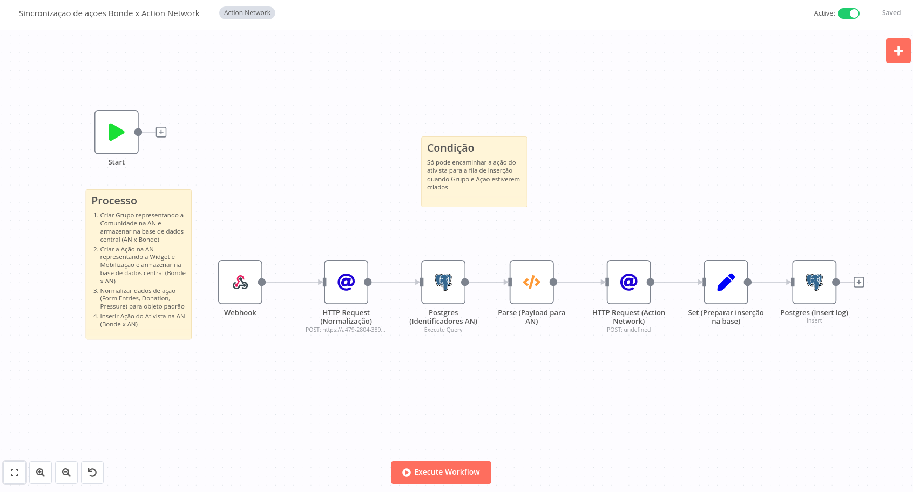
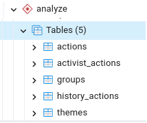
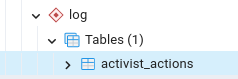
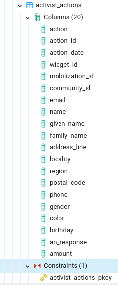

# Workflow de migração Ações de ativistas

Processo de normalização dos dados (Ações de ativistas)

Exemplos de ações de ativistas:

- Formulários (`"public".form_entries`)
- Pressão (`"public".activist_pressures`)
- Doação (`"public".donations`)

Para armazenar as informações normalizadas, foi criado uma estrutura em novos esquemas do banco de dados (PostgreSQL) chamados de `analyze` e `log`.

Após finalizado o processo de normalização dos dados de ação do ativista um novo registro é gerado na tabela `"analyze".activist_actions` que possui uma estrutura padrão para todas as ações de ativista, facilitando a analise dessas informações e o envio das mesmas há outras plataformas.

## TODO

- Documentar processo de log